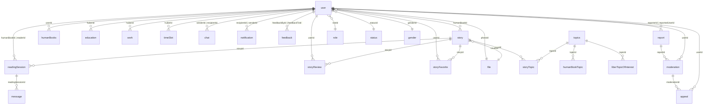

# HuLib Database Schema

## 1. User Domain (Trung tâm)

| Column | Type | Notes |
|--------|------|-------|
| id | Int | PK |
| fullName | String? | |
| email | String? | |
| phoneNumber | String? | |
| password | String? | |
| provider | String | "email" / "google" / "facebook" |
| socialId | String? | |
| birthday | String? | |
| address | String? | |
| bio | String? | |
| videoUrl | String? | |
| photoId | Uuid? | → file |
| coverImageId | Uuid? | → file |
| genderId | Int? | → gender |
| roleId | Int? | → role |
| statusId | Int? | → status |
| approval | String? | |
| warnCount | Int | default 0 |
| huberSince | DateTime? | |
| hasSeenHuberOnboarding | Boolean | |

```
gender ──< user >── role
status ──< user >── file (photo)
              ｜
              └── file (cover)
```

## 2. Story Domain

### story

| Column | Type | Notes |
|--------|------|-------|
| id | Int | PK |
| title | String | |
| abstract | String? | |
| humanBookId | Int | → user (FK) |
| coverId | Uuid? | → file |
| publishStatus | Int | 1=draft, 2=pending, 3=published... |
| viewCount | Int | default 0 |
| likeCount | Int | **denormalized** |
| shareCount | Int | **denormalized** |
| rejectionReason | String? | |
| createdAt | DateTime | |

### storyTopic (N-N: story ↔ topics)

| Column | Type |
|--------|------|
| storyId | Int (PK) → story |
| topicId | Int (PK) → topics |

### topics

| Column | Type | Notes |
|--------|------|-------|
| id | Int | PK |
| name | String | **UNIQUE** |
| color | TopicColor | enum |
| status | TopicStatus | active / inactive |

### storyReview

| Column | Type |
|--------|------|
| id | Int | PK |
| storyId | Int → story |
| userId | Int → user |
| rating | Int |
| preRating | Int? |
| title | String |
| comment | String |

### storyFavorite (N-N: user ↔ story)

| Column | Type |
|--------|------|
| userId | Int (PK) → user |
| storyId | Int (PK) → story |

```
topics ──< storyTopic >── story ──< storyReview >── user
                    ｜              ｜
                    ｜              └── storyFavorite >── user
                    ｜
                    └── humanBookTopic >── user
                    └── liberTopicOfInterest >── user
```

## 3. Huber Domain

### humanBooks

| Column | Type |
|--------|------|
| id | Int | PK |
| userId | Int → user |
| bio | String? |
| videoUrl | String? |
| education | String? |
| educationStart | Date? |
| educationEnd | Date? |

### humanBookTopic (N-N: huber ↔ topics)

| Column | Type |
|--------|------|
| userId | Int (PK) → user |
| topicId | Int (PK) → topics |

### liberTopicOfInterest (N-N: reader ↔ topics)

| Column | Type |
|--------|------|
| userId | Int (PK) → user |
| topicId | Int (PK) → topics |

### education

| Column | Type |
|--------|------|
| id | Int | PK |
| huberId | Int → user |
| major | String |
| institution | String |
| startedAt | Date |
| endedAt | Date? |

### work

| Column | Type |
|--------|------|
| id | Int | PK |
| huberId | Int → user |
| position | String |
| company | String |
| startedAt | Date |
| endedAt | Date? |

### timeSlot

| Column | Type |
|--------|------|
| id | Int | PK |
| huberId | Int → user |
| dayOfWeek | Int |
| startTime | String |
| endTime | String |

```
        ┌── humanBooks
        ├── humanBookTopic >── topics
user ───├── liberTopicOfInterest >── topics
        ├── education
        ├── work
        └── timeSlot
```

## 4. Reading Session Domain

### readingSession

| Column | Type | Notes |
|--------|------|-------|
| id | Int | PK |
| humanBookId | Int → user | Huber |
| readerId | Int → user | Reader |
| storyId | Int → story | |
| sessionStatus | enum | pending/approved/finished/canceled/missed |
| sessionUrl | String | Meeting URL |
| recordingUrl | String? | |
| startedAt | DateTime | |
| startTime | String | |
| endedAt | DateTime | |
| endTime | String | |
| note | String? | Reader's request |
| preRating | Int | |
| rating | Int | |
| rejectReason | String? | |

### message (in-session chat)

| Column | Type |
|--------|------|
| id | Int | PK |
| readingSessionId | Int → readingSession |
| humanBookId | Int → user |
| readerId | Int → user |
| content | String |

```
               ┌── user (humanBook)
user ──< readingSession >── story
               ｜
               ├── user (reader)
               └── message
```

## 5. Chat Domain

### chat

| Column | Type |
|--------|------|
| id | Int | PK |
| senderId | Int → user |
| recipientId | Int → user |
| message | String? |
| chatTypeId | Int? → chatType |
| stickerId | Int? → sticker |
| status | enum | sent/delivered/read/deleted |
| readAt | DateTime? |

```
user ──< chat >── user
              ｜
              ├── chatType
              └── sticker >── file
```

## 6. Notification Domain

### notification

| Column | Type |
|--------|------|
| id | Int | PK |
| recipientId | Int → user |
| senderId | Int → user |
| typeId | Int → notificationType |
| seen | Boolean |
| relatedEntityId | Int? |
| extraNote | String? |

```
notificationType ──< notification >── user (recipient)
                             ｜
                             └── user (sender)
```

## 7. Moderation Domain

### report

| Column | Type | Notes |
|--------|------|-------|
| id | Int | PK |
| reporterId | Int → user |
| reportedUserId | Int → user |
| reason | String | |
| customReason | String? | |
| rejectedReason | String? | |
| markAsResolved | Boolean | |
| **UNIQUE**(reporterId, reportedUserId) | |

### moderation

| Column | Type | Notes |
|--------|------|-------|
| id | Int | PK |
| userId | Int → user |
| reportId | Int? → report |
| actionType | enum | warn/unwarn/ban/unban |
| status | enum | active/reversed |
| manualReason | String? | |

### appeal

| Column | Type |
|--------|------|
| id | Int | PK |
| moderationId | Int → moderation |
| userId | Int → user |
| message | String |
| status | enum | pending/accepted/rejected |

```
user ──< report >── user (reported)
             ｜
             └── moderation ──< appeal >── user
```

## 8. Feedback Domain

### feedback

| Column | Type |
|--------|------|
| id | Int | PK |
| feedbackById | Int → user |
| feedbackToId | Int → user |
| rating | Float |
| preRating | Int? |
| content | String? |

```
user ──< feedback >── user
```

---

## Tổng quan ER Diagram (Mermaid)



### Quan hệ liên quan đến Contest Report

```
topics (name startsWith 'Khoảnh khắc')
  └── storyTopic
       └── story (likeCount, shareCount, viewCount)
            └── user (fullName, email, phoneNumber, bio)
```
